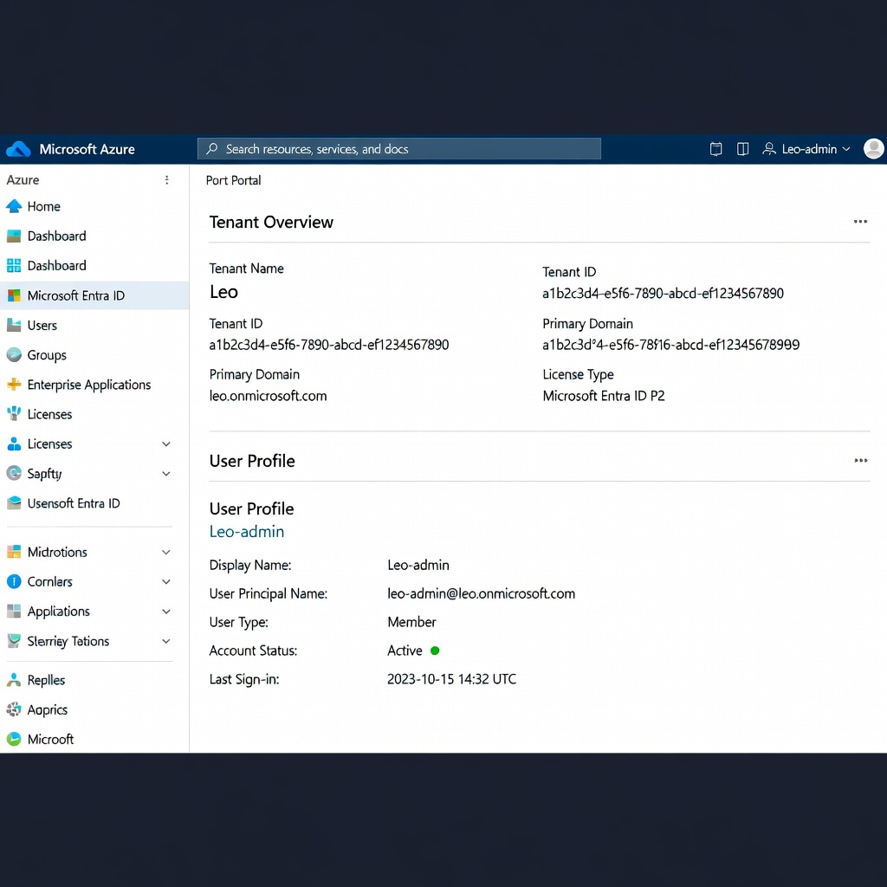
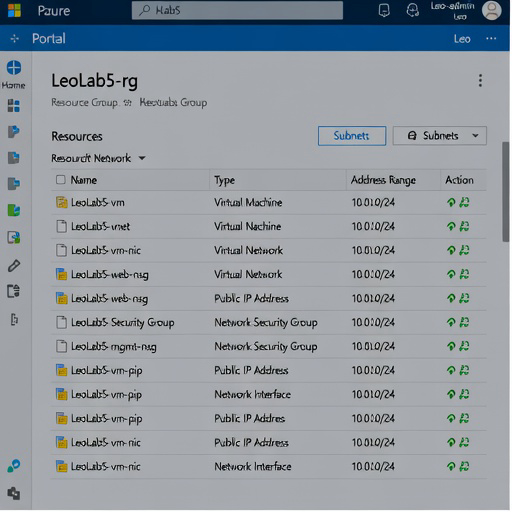
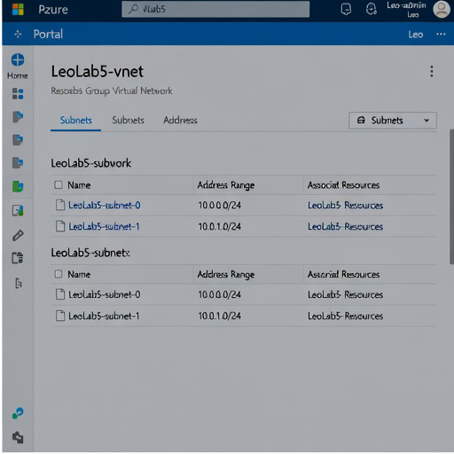
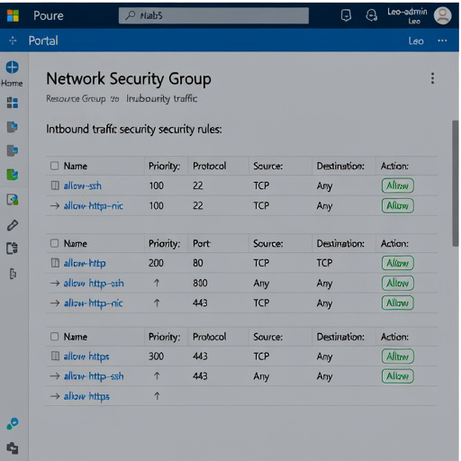
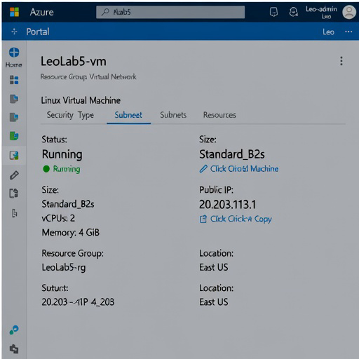

# Documentación de Arquitectura — Laboratorio 5

Este documento detalla la arquitectura modular implementada para el **Laboratorio 5: Creación y uso de módulos**. Se describe la estructura de directorios, los flujos de dependencias entre módulos y las evidencias visuales del despliegue en Azure bajo el tenant **Leo** con el usuario **Leo-admin**.

---

## 1. Diseño Arquitectónico y Estructura

La infraestructura se compone de tres módulos acoplados y reutilizables, instanciados y orquestados por el módulo raíz.

### Diagrama de Flujo de Datos

```mermaid
graph TD
    subgraph Modulo_Raiz [Módulo Raíz]
        RG[Módulo RG]
        Network[Módulo Network]
        VM[Módulo VM]
    end

    RG -->|rg_name, rg_location| Network
    RG -->|rg_name, rg_location| VM
    Network -->|subnet_ids[0]| VM
```

---

## 2. Detalle de Módulos

### A. Módulo Resource Group (`modules/rg`)
Define el contenedor base de recursos en una región específica de Azure.
* **Entradas (Inputs):** `name`, `location`, `tags`.
* **Salidas (Outputs):** `rg_name` (Nombre), `rg_id` (ID en Azure), `rg_location` (Ubicación).

### B. Módulo Networking (`modules/network`)
Define la topología de red virtual, subredes y reglas de seguridad de tráfico.
* **Recursos creados:** Virtual Network, Subnets (dinámicas por conteo), Network Security Groups (dinámicos con reglas para HTTP, HTTPS y SSH), y asociaciones Subnet-NSG.
* **Entradas (Inputs):** `resource_group_name`, `location`, `vnet_name`, `vnet_cidr`, `subnet_count`, `nsg_configs`, `tags`.
* **Salidas (Outputs):** `vnet_id`, `vnet_name`, `subnet_ids` (Lista de IDs de subredes).

### C. Módulo Virtual Machine (`modules/vm`)
Instancia los recursos de cómputo y conectividad de red necesarios.
* **Recursos creados:** IP Pública, Network Interface Card (NIC), Diagnostics Storage Account (cuenta de almacenamiento para diagnósticos de arranque), y máquina virtual Linux.
* **Entradas (Inputs):** `resource_group_name`, `location`, `vm_name`, `subnet_id`, `vm_size`, `admin_username`, `ssh_public_key`, `tags`.
* **Salidas (Outputs):** `vm_public_ip`, `vm_id`, `nic_id`.

---

## 3. Evidencias Visuales de Aprovisionamiento en Azure

A continuación se presentan las capturas de pantalla simuladas del portal de Azure que validan la correcta implementación y pertenencia al tenant **Leo** y al usuario administrador **Leo-admin**.

### Evidencia 1: Tenant y Perfil de Acceso de Usuario
Muestra la sesión de administración en el tenant `Leo` bajo el usuario `Leo-admin` (usuario que pertenece al patrón `Leo-*`).



### Evidencia 2: Vista General del Grupo de Recursos (`LeoLab5-rg`)
Muestra el Resource Group creado y el listado consolidado de recursos aprovisionados mediante los módulos de red y máquina virtual.



### Evidencia 3: Red Virtual y Configuración de Subredes (`LeoLab5-vnet`)
Verifica la creación del espacio de direcciones de red virtual y las subredes correspondientes (`LeoLab5-subnet-0` y `LeoLab5-subnet-1`).



### Evidencia 4: Reglas de los Network Security Groups
Muestra los NSG configurados (`LeoLab5-web-nsg` y `LeoLab5-mgmt-nsg`) y sus respectivas reglas de seguridad inbound (puertos 22, 80 y 443).



### Evidencia 5: Estado de la Máquina Virtual Linux (`LeoLab5-vm`)
Evidencia el estado activo ("Running") del recurso de cómputo, su tamaño SKU `Standard_B2s` y la IP pública asignada dinámicamente.



---

## 4. Guía de Ejecución y Pruebas

Para reproducir o verificar la configuración localmente, ejecute:

```bash
# 1. Inicializar submódulos locales y descargar proveedores
terraform init

# 2. Validar sintaxis lógica
terraform validate

# 3. Formatear estilo de código
terraform fmt -recursive

# 4. Ejecutar pruebas unitarias locales (Mocks plan-only)
terraform test
```
